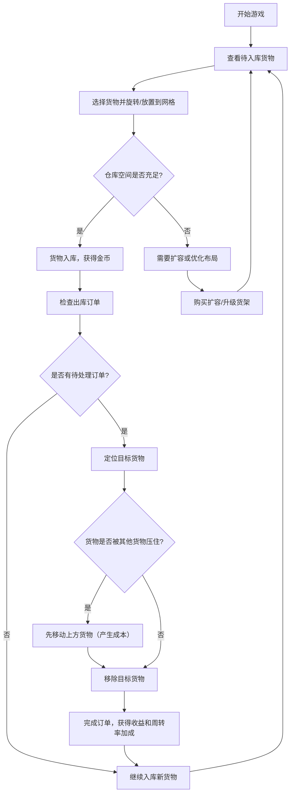

## 1. 产品概述

仓库存储空间管理模拟游戏是一款基于浏览器的策略模拟游戏。玩家扮演仓库管理员，在有限网格空间中规划货物摆放、响应出库订单、优化存储效率，并通过挑战关卡体验不同难度的订单序列。

- 目标用户：喜欢策略规划和解谜类游戏的玩家
- 核心价值：将"俄罗斯方块"式空间规划与库存管理策略结合，提供独特的管理模拟体验

## 2. 核心功能

### 2.1 用户角色

| 角色 | 说明 |
|------|------|
| 玩家 | 单角色，无需注册，直接开始游戏 |

### 2.2 功能模块

1. **仓库网格系统**：10×10可扩展网格，拖放/点击放置货物，支持旋转操作
2. **货物系统**：多种形状（1×2、1×3、2×2、L形等），每种有不同存储价值
3. **订单系统**：出库订单序列，需移除指定货物，被压货物需先移动（产生额外成本）
4. **仓库扩容**：消耗金币购买额外网格行列
5. **库存周转率**：频繁出入库的货物获得价值加成
6. **货架升级**：提升特定区域单位面积的存储价值
7. **热力图**：可视化显示仓库各区域使用频率
8. **挑战系统**：导入/导出订单序列JSON作为关卡
9. **撤销操作**：支持撤销上一步放置或移除操作
10. **存档系统**：导出/导入完整的仓库布局和库存清单JSON

### 2.3 页面详情

| 页面名称 | 模块名称 | 功能描述 |
|----------|----------|----------|
| 主游戏界面 | 仓库网格区 | 10×10网格，显示货物摆放、悬停预览、拖拽放置 |
| 主游戏界面 | 待入库货物面板 | 显示当前可放置的3-5个货物，可拖拽或点击旋转放置 |
| 主游戏界面 | 订单面板 | 显示当前出库订单队列，高亮目标货物，显示收益/成本 |
| 主游戏界面 | 状态栏 | 金币、得分、库存周转率、已用空间比例 |
| 主游戏界面 | 工具栏 | 撤销、导出、导入、扩容、热力图切换 |
| 主游戏界面 | 热力图覆层 | 显示仓库各区域使用频率的颜色映射 |
| 弹窗 | 扩容确认 | 显示扩容价格和效果预览 |
| 弹窗 | 货架升级 | 选择目标区域进行升级 |
| 弹窗 | 导入/导出 | 文件选择或JSON文本输入 |

## 3. 核心流程



## 4. 用户界面设计

### 4.1 设计风格

- **主题色调**：深色工业风格，主色为深灰蓝(#1a1d23)背景，搭配琥珀色(#f59e0b)和青绿色(#06d6a0)高亮
- **按钮风格**：圆角矩形，带轻微渐变和阴影，悬停有发光效果
- **字体**：标题使用"Orbitron"科技感字体，正文使用"Noto Sans SC"中文优雅字体
- **布局风格**：左侧仓库网格（主要区域），右侧信息面板（多层卡片布局）
- **图标风格**：简洁的CSS绘制图标，配合少量Emoji增强可读性

### 4.2 页面设计概览

| 页面名称 | 模块名称 | UI元素 |
|----------|----------|--------|
| 主游戏界面 | 仓库网格 | 10×10方形网格，单元格带微妙边框，放置的货物带光泽效果和阴影 |
| 主游戏界面 | 待入库货物面板 | 横向排列的货物卡片，显示形状预览和分值，支持拖拽 |
| 主游戏界面 | 订单面板 | 垂直列表，显示货物图标、需求数量、剩余时间/步数 |
| 主游戏界面 | 状态栏 | 顶部横条，显示金币(🪙)、得分(⭐)、周转率(🔄)三个指标 |
| 主游戏界面 | 工具栏 | 顶部图标按钮组，带工具提示 |
| 主游戏界面 | 热力图 | 半透明彩色覆层，红=高频，蓝=低频 |

### 4.3 响应式设计

- 桌面端优先设计（1280×720及以上）
- 网格单元格最小40px
- 移动端采用垂直布局：仓库网格在上，面板在下

## 5. 游戏机制详细设计

### 5.1 货物类型

| 形状 | 尺寸 | 基础价值 | 出现频率 |
|------|------|----------|----------|
| 小箱 | 1×1 | 10 | 高 |
| 横条 | 1×2 | 25 | 高 |
| 竖条 | 2×1 | 25 | 中 |
| 大方箱 | 2×2 | 60 | 中 |
| 横长条 | 1×3 | 45 | 中 |
| 竖长条 | 3×1 | 45 | 低 |
| L形(右下) | 2×2(L) | 55 | 低 |
| L形(左下) | 2×2(L) | 55 | 低 |

### 5.2 仓储机制

- 货物可在网格内任意位置放置（占据的单元格必须全部为空）
- 货物可通过R键旋转（90度每次）
- 出库时，如果目标货物上方有其他货物，需先移动上方货物（每次移动成本=货物基础价值×0.3）
- 当整个网格使用率达80%时，触发扩容提示

### 5.3 库存周转率

- 每种货物类型维护一个"周转计数"
- 每次出库该类型货物，周转计数+1
- 周转率 = 周转计数 / 最大周转计数（全局归一化）
- 高周转率货物获得价值加成：加成系数 = 1 + 周转率 × 0.5

### 5.4 扩容与升级

- 扩容：每次增加1行或1列，价格为 500 + 当前尺寸 × 100 金币
- 货架升级：选中单个单元格，花费200金币，使该格存储价值×1.5

### 5.5 得分系统

- 放置货物得分 = 货物基础价值
- 完成订单得分 = 货物价值 × (1 + 周转率加成)
- 移动成本扣分 = -货物价值 × 0.3
- 总金币 = 累计得分 - 扩容花费 - 升级花费

### 5.6 挑战系统

JSON格式定义挑战关卡：

```json
{
  "name": "挑战1：新手入门",
  "gridSize": 10,
  "initialLayout": [],
  "incomingCargo": [{"type": "1x1", "count": 5}, ...],
  "orders": [{"type": "1x1", "atStep": 3}, {"type": "2x2", "atStep": 7}],
  "targetScore": 500
}
```