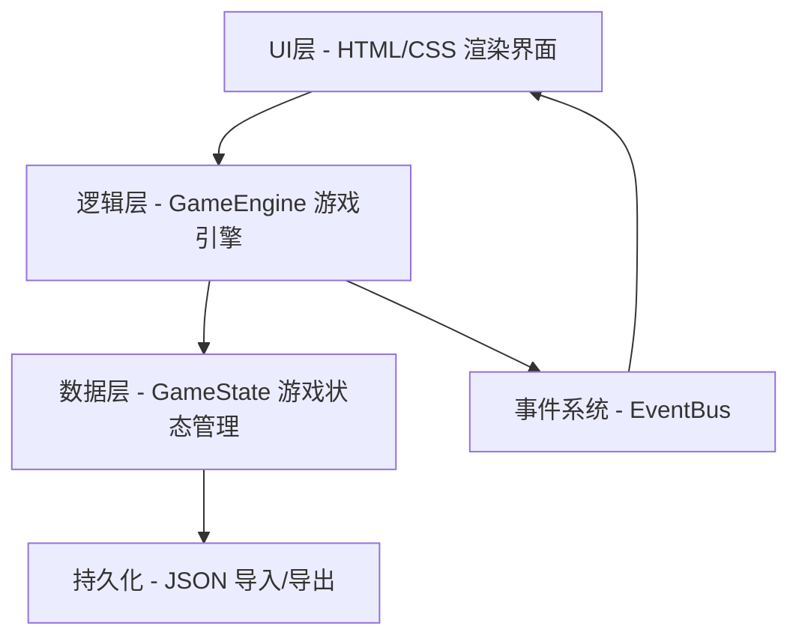

## 1. 架构设计



单页面应用架构，无需后端服务，所有逻辑在前端浏览器中运行。

## 2. 技术说明

- **前端**：原生 HTML5 + CSS3 + Vanilla JavaScript (ES6+)
- **构建工具**：无，直接通过浏览器打开 index.html
- **后端**：无
- **数据存储**：浏览器 LocalStorage（自动存档）+ JSON文件导入/导出
- **拖拽**：原生 HTML5 Drag & Drop API

## 3. 文件结构

```
/
├── index.html              # 主页面
├── css/
│   ├── style.css           # 主样式表
│   ├── grid.css            # 仓库网格样式
│   └── components.css      # 组件样式
├── js/
│   ├── main.js             # 入口文件，初始化游戏
│   ├── game-engine.js      # 游戏核心引擎
│   ├── grid.js             # 网格数据结构和操作
│   ├── cargo.js            # 货物类型定义和生成
│   ├── order.js            # 订单系统
│   ├── inventory.js        # 库存和管理
│   ├── heatmap.js          # 热力图计算和渲染
│   ├── upgrade.js          # 扩容和升级系统
│   ├── challenge.js        # 挑战关卡导入导出
│   ├── undo.js             # 撤销操作栈
│   ├── renderer.js         # DOM渲染器
│   ├── drag-drop.js        # 拖拽系统
│   ├── event-bus.js        # 事件总线
│   ├── storage.js          # LocalStorage 持久化
│   └── utils.js            # 工具函数
└── data/
    └── challenges/         # 预置挑战关卡JSON
```

## 4. 数据模型

### 4.1 核心数据结构

```javascript
// 网格单元格
Cell {
  occupied: boolean,        // 是否被占用
  cargoId: string|null,     // 占用该格子的货物ID
  upgradeLevel: number,     // 货架升级等级 (0, 1, 2)
  accessCount: number,      // 访问次数（用于热力图）
}

// 货物实例
CargoInstance {
  id: string,               // 唯一标识
  type: string,             // 货物类型: '1x1', '1x2', '2x1', '2x2', '1x3', '3x1', 'L-DR', 'L-DL'
  shape: number[][],        // 形状矩阵 [[1,1],[1,0]] 等
  position: {row, col}|null,// 在网格中的位置（左上角）
  rotation: number,         // 旋转角度 (0, 90, 180, 270)
  baseValue: number,        // 基础存储价值
  turnoverCount: number,    // 周转计数
  placed: boolean,          // 是否已放置
}

// 订单
Order {
  id: string,
  cargoType: string,        // 需求货物类型
  atStep: number,           // 触发步数（第几步后激活）
  completed: boolean,
  reward: number,           // 完成奖励
}

// 游戏状态
GameState {
  gridSize: {rows, cols},   // 网格尺寸
  grid: Cell[][],           // 网格数据
  cargos: CargoInstance[],  // 所有货物
  pendingCargos: CargoInstance[], // 待入库货物
  orders: Order[],          // 订单队列
  gold: number,             // 金币
  score: number,            // 得分
  step: number,             // 当前步数
  globalMaxTurnover: number,// 全局最大周转计数
  undoStack: Action[],      // 撤销栈
}
```

## 5. 核心游戏引擎 (GameEngine)

### 5.1 主要方法

| 方法 | 功能 |
|------|------|
| `placeCargo(cargoId, row, col, rotation)` | 放置货物到指定位置 |
| `removeCargo(cargoId)` | 移除货物（含上方货物检查） |
| `rotateCargo(cargoId)` | 旋转货物 |
| `processOrder(orderId)` | 处理出库订单 |
| `expandGrid(direction)` | 扩容仓库 |
| `upgradeCell(row, col)` | 升级单元格货架 |
| `undo()` | 撤销上一步操作 |
| `exportState()` | 导出游戏状态为JSON |
| `importState(json)` | 从JSON导入游戏状态 |
| `importChallenge(json)` | 导入挑战关卡 |
| `generateCargo()` | 生成新的待入库货物 |
| `calculateTurnoverBonus(type)` | 计算周转率加成 |
| `updateHeatmap()` | 更新热力图数据 |

### 5.2 碰撞检测

货物放置时进行碰撞检测：
- 检查货物矩阵每个单元格是否超出网格边界
- 检查对应网格单元格是否已被占用
- 只有全部检查通过才允许放置

### 5.3 遮挡检测

出库时检测目标货物是否被遮挡：
- 对目标货物上方每个单元格进行遍历
- 检查是否有其他货物占据这些位置
- 优先移除最上方的遮挡货物
- 累积移动成本

## 6. 事件系统

```javascript
// 事件总线用于组件间通信
EventBus.on('cargo:placed', (cargo) => { ... });
EventBus.on('cargo:removed', (cargo) => { ... });
EventBus.on('order:completed', (order) => { ... });
EventBus.on('grid:expanded', (newSize) => { ... });
EventBus.on('score:changed', (score) => { ... });
EventBus.on('game:over', () => { ... });
EventBus.on('challenge:loaded', (challenge) => { ... });
```